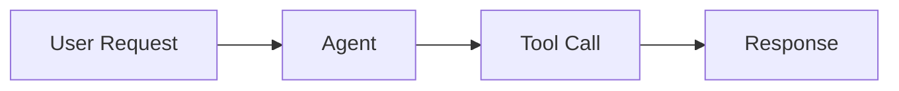

# Blog Post Formatting Guide

## Post Anatomy

Every post should follow this structure. Not every section needs a heading — some flow naturally as paragraphs.

```markdown
---
title: "Post Title"
date: YYYY-MM-DD
author: Sam Graham
tags: ["tag-one"]
categories: ["Category Name"]
hide:
  - navigation
  - toc
---

Excerpt: 1-3 sentences that hook the reader. State what they'll learn
or why this matters right now.

<!-- more -->

## The Problem / Hook

Frame the problem or question. Why should the reader care?

## Context

What does the reader already know? What's changed recently?

## Core Argument

Your thesis with supporting evidence. This is the meat of the post.

## Example

Concrete walkthrough — code snippet, architecture diagram, or real scenario.

## Trade-offs

Honest assessment. What are the limitations? When would you choose differently?

## Takeaways

- Bullet point 1
- Bullet point 2
- Bullet point 3
```

## Heading Rules

- **Never use H1** (`#`) — the post title from frontmatter renders as H1
- **H2** (`##`) for major sections
- **H3** (`###`) sparingly, for subsections within an H2
- **H4+** avoid entirely — if you need H4, restructure

## Code Block Conventions

Always include a language tag:

````markdown
```python
def example():
    pass
```
````

Available options:
- `hl_lines="2 3"` — highlight specific lines
- `linenums="1"` — show line numbers (use for blocks > 5 lines)
- Keep blocks **under 25 lines**. If longer, split into multiple blocks with explanatory text between them.
- Prefer showing only the relevant portion with comments like `# ... existing code ...` for context.

## Mermaid Diagram Guidelines

Use Mermaid diagrams for architecture, workflows, and system interactions:

````markdown

*Figure: Agent request-response flow*
````

Rules:
- **Under 15 nodes** — simplify if more complex
- **Always add a caption** as italic text below the diagram
- Use `graph LR` (left-right) for flows, `graph TD` (top-down) for hierarchies
- Use `sequenceDiagram` for multi-actor interactions

## Excerpt Best Practices

The excerpt is everything before `<!-- more -->`. It appears on the blog listing page.

- **1-3 sentences maximum**
- **State the value**: What will the reader learn or be able to do?
- **Avoid throat-clearing**: No "In this post, we'll explore..." — just state the insight
- **Create tension**: Hint at a surprising finding or common misconception

Good: "Most teams bolt observability onto their agent systems as an afterthought. Here's why that guarantees you'll miss the failures that matter most."

Bad: "In this post, we'll look at observability for AI agents and discuss some best practices."

## Tag Vocabulary

Use these established tags. Add new ones only when no existing tag fits — and flag the addition for review.

**Agentic AI:**
`agents`, `llm`, `rag`, `prompt-engineering`, `orchestration`, `tool-use`, `evaluation`, `guardrails`, `memory`, `planning`

**LLMOps / Production:**
`observability`, `tracing`, `cost-management`, `latency`, `model-routing`, `fine-tuning`, `deployment`, `monitoring`, `reliability`

**Frameworks & Tools:**
`claude-code`, `langchain`, `llamaindex`, `autogen`, `crew-ai`, `openai`, `anthropic`

**Software Engineering:**
`architecture`, `systems-design`, `testing`, `mocks`, `stubs`, `ci-cd`, `devops`, `local-dev`

**General:**
`best-practices`, `patterns`, `anti-patterns`, `tutorial`, `deep-dive`, `opinion`

## Category Vocabulary

Posts must use one of these categories:

| Category                  | Use for                                                  |
|---------------------------|----------------------------------------------------------|
| `Agentic Development`     | Building agents: patterns, tool use, orchestration       |
| `LLMOps`                  | Production operations: deploying, monitoring, scaling    |
| `Software Architecture`   | System design, API design, data modeling                 |
| `Systems Design`          | Distributed systems, infrastructure, scalability         |
| `Testing`                 | Test strategies, mocking, integration testing            |
| `Developer Tooling`       | IDEs, CLI tools, local dev environments                  |
| `Engineering Culture`     | Team practices, decision-making, process                 |

## Tone and Voice

- **Precise**: Use exact terms. "Latency p99 increased 3x" not "things got slower"
- **Opinionated**: Take a stance. "You should do X because Y" not "some people prefer X"
- **Conversational, not casual**: Write like you're explaining to a sharp colleague, not posting on social media
- **Show, don't tell**: Prefer examples and diagrams over abstract descriptions
- **Respect the reader**: Assume they're competent. Don't over-explain basics unless the post targets beginners (tag it `tutorial`)
