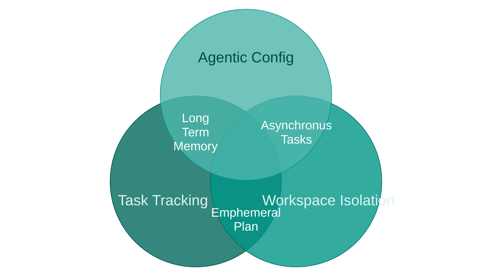
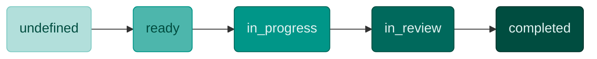
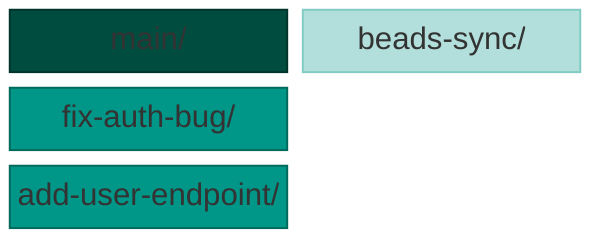

My dev agent(s) are as crucial to my product outcome as any other first-class team member. Just like any new team member, my agentic setup is based on; issue tracking, workspace isolation, quality gate controls, and the ability to learn over time (self-update). Take a look... 

<!-- more -->

## The Three Pillars

In order to move from 'vibe' to 'agentic' coding, I've ended up with this taxonomy. First we'll take a look at the three major components of my harness skaffolding. Then I'll describe how the agentic value arises within cross-sections of the components.



### Task Tracking

The core functionality of the task tracker is the same as JIRA or Trello. Tasks are stored as indiviudal entities mapped to Epics, and may contain subtasks. Each task entity has a status property and the task lifecycle is represented as a progression through the statuses:


*Task status lifecycle — states progress from light to dark as work moves toward completion*

I use [Beads](https://github.com/beads-project/beads) task manager, which stores tasks, epics, and dependency relationships within the repo in the form of a Dolt database. I use [Beads Viewer](https://github.com/Dicklesworthstone/beads_viewer) atop Beads to easily triage and expose task dependencies.
The `.beads/` directory in every workspace is symlinked to a single persistent checkout (`beads-sync/`), so task state stays consistent no matter which branch I'm on. This is what enables parallelism: multiple agent sessions can work on independent tasks simultaneously, each isolated, all reading from the same task graph.


```
BannerFM/
├── main/                   ← primary checkout
├── beads-sync/             ← persistent shared task store
├── fix-auth-bug/           ← task workspace (ephemeral)
└── add-user-endpoint/      ← task workspace (ephemeral)

Each branch of main symlinks to ./beads --> beads-sync/.beads/
```

### Workspace Isolation

Each task needs its own workspace so that changes don't bleed across workstreams. Without isolation, I found that agents working on one task would inadvertently stage or modify files belonging to another. Separate workspaces also mean separate git branches, which makes the eventual PR a clean diff of just that task's changes.



I use [**cmux**](https://cmux.com/) to spin up a workspace per task — each gets its own terminal session and git branch. One of the biggest benefits is that [cmux was specifically designed](https://github.com/craigsc/cmux?tab=readme-ov-file#cmux--tmux-for-claude-code) to easily spin up Claude agents in terminal workspaces by leveraging git worktrees.

### The Agent Configuration

The purpose of skaffolding, or agentic configuration, is to define the workflow the agent executes. It's the same workflow that I'd force upon a new dev added unto my team. Research a topic and its tech, create a high level plan, break that down into ttasks, and implement tasks indiviudal as bit sized chunks. It's not rocket science, but it is methodical and repeatable.

The whole dev process is kicked off with slash commands, the core of which realize the task lifecycle through four steps:

```
┌─────────────────┐
│  /task-selector │  Pick from backlog or plan new work
└────────┬────────┘
         │
         ▼
┌─────────────────┐
│   /start-task   │  Create cmux workspace + git branch, claim task
└────────┬────────┘
         │
         ▼
┌─────────────────┐
│    Development  │  /build → /test → /code-review
│                 │  /scaffold-endpoint, /design-migration
└────────┬────────┘
         │
         ▼
┌─────────────────┐
│   /finish-task  │  Push, create PR, transition to review,
│                 │  verify merge, close task, cleanup
└─────────────────┘
```

I've found that coding agents tend to go off the rails without a clear (and often re-enforced) directions. This means keeping the task a hand moderately scoped and providing plenty of knowledge regarding the codebase and its patterns. The approach that has been successfully for me is three pronged. Thhere force, my process puts a lot of upfront effort in planning. There are two planning phases:

1. The **brainstorming** skill runs research-driven Q&A to define epics and tasks, then auto-decomposes large tasks into properly-sized subtasks (~5 files, ~150 lines changed per task). This step produces only a high-level plan that persists in Beads tasks.
2. The **writing-plans** skill is triggered when the `/start-task` slash command is invoked for a tasks with an `undefined` status. This skill generates an detailed implementation plan as a markdown file.


#### Project Specs: Agent-Facing Knowledge

A `project-spec/` directory contains five structured documents designed for agent parsing — not human narrative. Each spec uses tables, file-to-entity mappings, and explicit caveats rather than prose:

- **overview** — implementation status matrix, domain hierarchy, universal conventions
- **architecture** — bootstrap sequence, interface ownership, constructor patterns, file lookup map
- **domain-model** — entity-to-file-to-table mapping, field type conventions, error system
- **api-surface** — endpoint table, response envelope structure, new-endpoint sequence
- **data-layer** — repo-to-table mapping, CRUD signatures, SQL patterns, documented known bugs with file/line references

I think of these as the agent's mental model of the codebase. Instead of discovering architecture by reading source files — an expensive, error-prone process — the agent reads a structured summary that tells it where things are, how they connect, and what the gotchas are. At least in my experience, this has cut down significantly on the agent wandering through the codebase before it can start real work.
Update of the project specs is deterministic, as it is a skill triggered by pre-commit hook.

## Putting It Together

The three pillars — issue tracking, workspace isolation, and agentic configuration — form a closed loop.

> **Ephemeral Plan** — Because task tracking decomposes work into scoped units and workspace isolation gives each unit its own branch, every task starts with a focused implementation plan that lives only as long as the task itself. The plan doesn't need to survive beyond the PR — it's disposable by design, which is what keeps it specific enough to be useful.

> **Long Term Memory** — Task tracking persists the full history of what was done and why, and the agentic config includes project specs that encode the current state of the codebase. Together, they give the agent a durable memory that spans sessions — the task graph provides context on past decisions, while the specs provide a structured snapshot of where things stand now.

> **Asynchronous Tasks** — Workspace isolation means each task runs in its own branch and terminal, and the agentic config defines the workflow each agent follows independently. This combination is what makes it possible to run multiple agents on separate tasks in parallel — each one follows the same procedures in its own isolated environment, without coordination overhead.

The result, for me, is a setup where the agent operates with roughly the same structure I'd expect from a human teammate: picking work from a prioritized backlog, working in isolation, following established procedures, reviewing its own output, and keeping documentation current. I've found that the scaffolding doesn't make the agent smarter — it improves _consistenty_.
